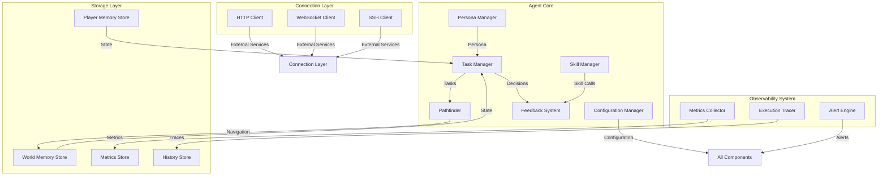
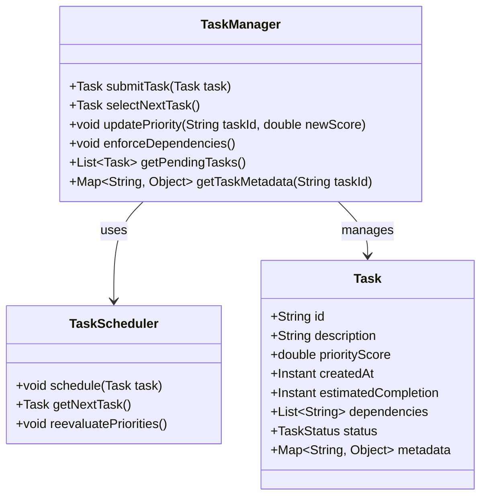
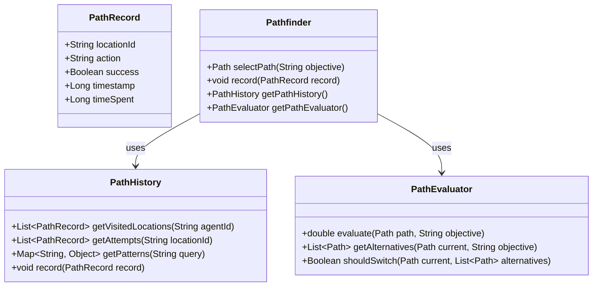
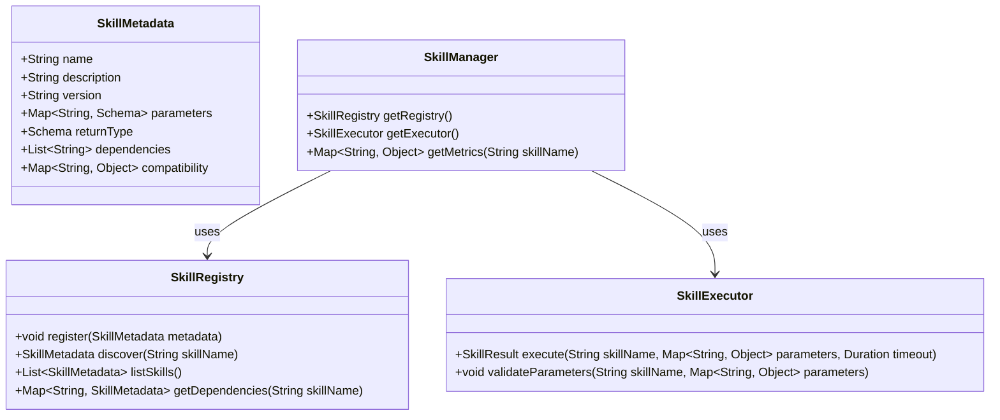
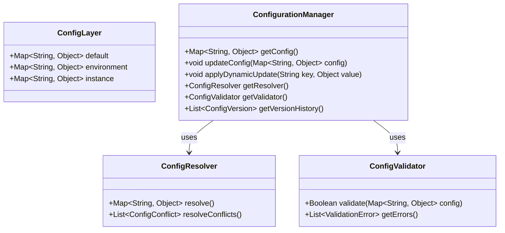
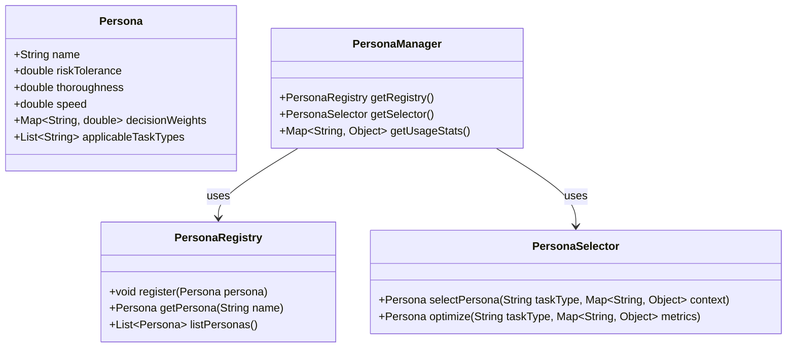
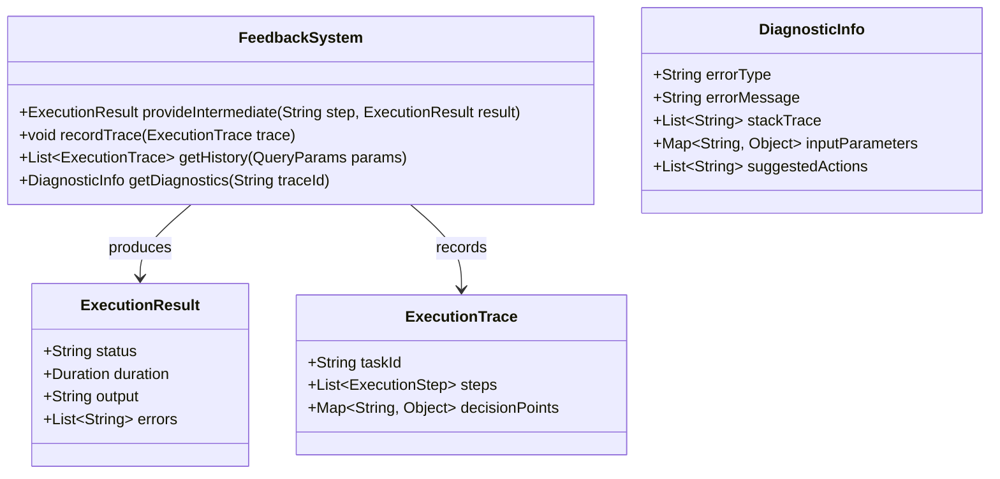
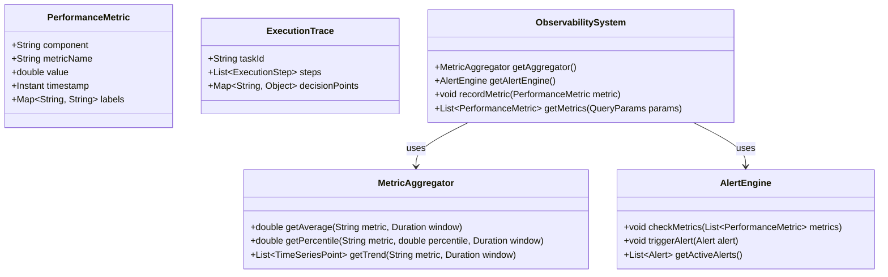

# Design Document: Agent and Skills Improvements

## Overview

This document outlines the technical design for improving the AI agent system architecture. The improvements address twelve key areas: dynamic task management, improved observability, scalable state management, efficient connection layer, improved pathfinding, real-time memory updates, player personas, feedback loop enhancement, task execution monitoring, memory separation, skill management, and configuration management.

The agent will be re-architected to support dynamic prioritization, comprehensive observability, and structured management of skills, configuration, and memory. All components will be designed with modularity, scalability, and maintainability in mind.

## Architecture



### Component Responsibilities

| Component | Responsibilities |
|-----------|------------------|
| **Task Manager** | Dynamic task prioritization, dependency management, continuous re-evaluation |
| **Pathfinder** | Efficient navigation, history tracking, alternative path evaluation |
| **Skill Manager** | Skill registration, invocation, dependency management, metrics |
| **Configuration Manager** | Hierarchical config, dynamic reconfiguration, validation, conflict resolution |
| **Persona Manager** | Exploration style management, performance-based optimization |
| **Feedback System** | Execution results, diagnostics, history presentation |
| **Metrics Collector** | Performance metrics, token usage, error rates |
| **Execution Tracer** | Detailed execution traces, decision tracking |
| **Alert Engine** | Performance alerts, anomaly detection, notification |
| **World Memory** | Environmental data, object locations, map connections |
| **Player Memory** | Agent state, inventory, skills, preferences |

## Components and Interfaces

### Task Manager

The Task Manager is responsible for managing the agent's task queue and prioritization logic.



**Key Interfaces:**

- `TaskManager`: Main interface for task submission, selection, and management
- `TaskScheduler`: Internal scheduler for task ordering and re-evaluation

### Pathfinder

The Pathfinder manages navigation and task planning.



### Skill Manager

The Skill Manager handles skill registration, invocation, and dependency management.



### Configuration Manager

The Configuration Manager handles hierarchical configuration with dynamic updates.



### Persona Manager

The Persona Manager handles exploration style configuration.



### Feedback System

The Feedback System provides execution results and diagnostics.



### Observability System

The Observability System provides performance monitoring and alerts.



## Data Models

### Task

```json
{
  "id": "string (UUID)",
  "description": "string",
  "priorityScore": "double",
  "createdAt": "ISO8601 timestamp",
  "estimatedCompletion": "ISO8601 timestamp",
  "dependencies": ["string (UUID)"],
  "status": "pending | running | completed | failed",
  "metadata": {
    "urgency": "integer",
    "resourceRequirements": "object",
    "lastReevaluated": "ISO8601 timestamp"
  }
}
```

### Skill Metadata

```json
{
  "name": "string",
  "description": "string",
  "version": "string",
  "parameters": {
    "paramName": {
      "type": "string",
      "required": "boolean",
      "description": "string"
    }
  },
  "returnType": {
    "type": "string",
    "schema": "object"
  },
  "dependencies": ["string"],
  "compatibility": {
    "minVersion": "string",
    "platforms": ["string"]
  }
}
```

### Persona

```json
{
  "name": "string",
  "riskTolerance": "double (0.0 - 1.0)",
  "thoroughness": "double (0.0 - 1.0)",
  "speed": "double (0.0 - 1.0)",
  "decisionWeights": {
    "stepCount": "double",
    "timeEstimate": "double",
    "resourceRequirements": "double",
    "successProbability": "double"
  },
  "applicableTaskTypes": ["string"]
}
```

### Execution Trace

```json
{
  "taskId": "string (UUID)",
  "steps": [
    {
      "stepName": "string",
      "status": "success | warning | error",
      "duration": "integer (milliseconds)",
      "output": "string",
      "errors": ["string"]
    }
  ],
  "decisionPoints": [
    {
      "timestamp": "ISO8601 timestamp",
      "option1": "string",
      "option2": "string",
      "selected": "string",
      "rationale": "string"
    }
  ]
}
```

### Performance Metric

```json
{
  "component": "string",
  "metricName": "string",
  "value": "double",
  "timestamp": "ISO8601 timestamp",
  "labels": {
    "environment": "string",
    "agentId": "string"
  }
}
```

## Storage Strategy

### World Memory Store

- **Primary Storage**: JSON files in `data/world/` directory
- **Structure**: Separate JSON files for locations, objects, NPCs, quests, connections
- **File Naming**: Hash-based or sequential IDs (e.g., `location_123.json`, `object_456.json`)
- **Indexing**: In-memory index map for fast lookups, maintained in memory
- **Capacity**: 10,000+ records
- **Query Performance**: <100ms for single-key lookups via in-memory index
- **Spatial Queries**: Support for "objects within N rooms" via spatial index on locations

### Player Memory Store

- **Primary Storage**: JSON files in `data/player/` directory
- **Structure**: Separate JSON files for inventory, skills, achievements, personal notes, behavioral patterns
- **File Naming**: Agent ID based (e.g., `{agentId}_inventory.json`, `{agentId}_skills.json`)
- **Indexing**: In-memory index map per agent type for fast lookups
- **Capacity**: 1,000+ records per player
- **Query Performance**: <50ms for reads, <200ms for writes (95th percentile)
- **Temporal Queries**: Support for "items acquired in last hour" via timestamp-based file filtering

### Metrics Store

- **Primary Storage**: JSON files in `data/metrics/` directory
- **Structure**: Hourly aggregation with timestamp-based file naming
- **File Naming**: Time-series (e.g., `metrics_2024-01-15T14:00.json`)
- **Retention**: 7 days minimum with rotation
- **Aggregation**: Hourly summaries for long-term storage

### History Store

- **Primary Storage**: JSON files in `data/history/` directory
- **Structure**: Execution traces, navigation history
- **File Naming**: Agent ID + timestamp (e.g., `{agentId}_history_2024-01-15.json`)
- **Retention**: 7 days minimum with rotation
- **Query Performance**: <2s for 10,000 record queries via file filtering

## Connection Layer Design

### Protocol Abstractions

All connections use a common interface with protocol-specific implementations.

```json
{
  "interface": {
    "connect": {
      "timeout": "5 seconds"
    },
    "heartbeat": {
      "interval": "30 seconds"
    },
    "close": {
      "timeout": "2 seconds"
    }
  },
  "protocolImplementations": {
    "http": {
      "authentication": ["basic", "bearer", "oauth2"],
      "retry": {
        "maxAttempts": 3,
        "backoff": "exponential",
        "initialDelay": "1 second"
      }
    },
    "websocket": {
      "authentication": ["bearer"],
      "pingInterval": "30 seconds"
    },
    "ssh": {
      "authentication": ["key", "password"],
      "keepAlive": "30 seconds"
    }
  }
}
```

### Connection Health Monitoring

- **Metrics**: Uptime, latency (P50 <100ms, P95 <500ms), error rate
- **API Endpoint**: Health status available in <50ms
- **Health Check**: Periodic connectivity tests to all connected services

## State Management

### Architecture

The state management system uses a dual-store approach with JSON files:

1. **World Memory**: Environmental data stored in JSON files under `data/world/`
2. **Player Memory**: Agent-specific data stored in JSON files under `data/player/`

### File Structure

```
data/
├── world/
│   ├── locations/
│   │   └── {locationId}.json
│   ├── objects/
│   │   └── {objectId}.json
│   ├── npcs/
│   │   └── {npcId}.json
│   ├── quests/
│   │   └── {questId}.json
│   └── connections/
│       └── {connectionId}.json
├── player/
│   ├── {agentId}_inventory.json
│   ├── {agentId}_skills.json
│   ├── {agentId}_achievements.json
│   └── {agentId}_notes.json
├── metrics/
│   └── metrics_{timestamp}.json
└── history/
    └── {agentId}_history_{date}.json
```

### JSON Format

All JSON files follow a consistent schema with versioning and metadata:

```json
{
  "version": "1.0.0",
  "createdAt": "ISO8601 timestamp",
  "updatedAt": "ISO8601 timestamp",
  "type": "location|object|skill|achievement",
  "data": { ... }
}
```

### Index Management

- In-memory index maps maintained for fast lookups by ID
- Index is rebuilt on agent startup from file system
- Changes are applied to both file and index atomically
- Index size: <100MB for 10,000 records

### Persistence Guarantees

- **Write Latency**: <200ms for updates under 10KB (95th percentile)
- **Read Latency**: <50ms for indexed lookups
- **Concurrency**: File locking for write operations
- **Atomicity**: File write + rename pattern for atomic updates
- **Durability**: Sync to disk on critical updates

### Transaction Support

- **Atomicity**: Multi-step updates use temp files + rename
- **Isolation**: File locking for write operations
- **Rollback**: Previous version retained during updates

### Concurrency Control

- **File Locking**: OS-level file locks for write operations
- **Conflict Detection**: Version numbers in file metadata
- **Resolution Strategy**: Last-writer-wins with timestamp

## Task Manager Design

### Priority Scoring Algorithm

Tasks are scored using a multi-factor algorithm:

```json
{
  "priorityScore": "double",
  "factors": {
    "urgency": "0.0 - 1.0 (weight: 30%)",
    "dependencyStatus": "0.0 - 1.0 (weight: 25%)",
    "resourceRequirements": "0.0 - 1.0 (weight: 20%)",
    "expectedValue": "0.0 - 1.0 (weight: 25%)"
  },
  "recalculation": {
    "interval": "30 seconds",
    "maxLatency": "500ms"
  }
}
```

### Dependency Enforcement

Dependencies are enforced through:

1. **Topological Sorting**: Tasks are ordered by dependency chain
2. **Constraint Checking**: Dependencies validated before execution
3. **Fallback Handling**: If prioritization fails, next-highest priority task selected

## Observability System Design

### Metrics Collection

- **Performance Metrics**: Execution duration, resource utilization
- **Token Usage**: LLM input/output tokens (±5% accuracy primary, ±10% secondary)
- **Error Rates**: Per-component tracking with moving average alerts

### Alerting Thresholds

| Component Type | Error Rate Threshold | Alert Window |
|---------------|---------------------|--------------|
| Critical | >5% | 5-minute moving average |
| Non-Critical | >10% | 5-minute moving average |

### Alert Channels

- In-app notification
- Email
- Webhook

## Pathfinding Design

### Navigation History

Records visited locations, attempted actions, successful outcomes, and time spent.

### Path Evaluation

Paths are scored using a multi-criteria system:

- Step count (40%)
- Time estimate (30%)
- Resource requirements (20%)
- Success probability (10%)

### Adaptive Search

- **Max Backtracking Distance**: 3 steps (configurable)
- **Patience Threshold**: 10 failed attempts (configurable)
- **Exploration/Exploitation**: Adjusts based on domain characteristics

## Skill Management System

### Skill Registry

Skills are registered with metadata including parameters, return type, dependencies, and compatibility.

### Skill Invocation

- **Parameter Validation**: Type checking and required field validation
- **Timeout Protection**: Default 30 seconds, configurable
- **Result Packaging**: Success/failure status, duration, output/error

### Dependency Management

- **Circular Dependency Detection**: Rejected during registration
- **Availability Checking**: Dependencies verified before invocation
- **Dependency Graphs**: Available via API for visualization

## Configuration Management

### Hierarchical Layers

1. **Default**: System-provided
2. **Environment**: Development/staging/production
3. **Instance**: Agent-specific

### Dynamic Reconfiguration

- **Update Latency**: <2 seconds for config changes
- **Restart-Free**: 80%+ of config types support dynamic updates
- **Validation**: Schema validation before application

### Conflict Resolution

- **Detection**: Automatic on config application
- **Guidance**: Provides severity, affected components, and suggested fixes

## Error Handling

### Task Manager

- Failed prioritization logs error and selects next-highest priority task
- Dependency violations are logged and tasks are re-scheduled

### Memory Store

- Invalid updates are rejected with specific error messages
- Previous valid state is preserved
- Transaction failures trigger rollback

### Skill Manager

- Parameter errors provide detailed validation messages
- Timeout errors include execution duration and suggested actions
- Dependency failures list missing/unsatisfied dependencies

### Configuration Manager

- Invalid configs are rejected with specific validation errors
- Conflicts provide resolution guidance
- Persistence failures trigger backup/restore attempts

## Testing Strategy

### Unit Tests

- Test specific examples and edge cases
- Focus on: UI interactions, integration points, error conditions
- Avoid excessive unit tests where property-based tests suffice

### Property-Based Tests

When applicable, use property-based testing with:

- **Minimum Iterations**: 100 per property
- **Tagging Format**: `Feature: agent-and-skills-improvements, Property {number}: {property_text}`
- **Property Types**:
  1. **Invariants**: Properties preserved after transformation
  2. **Round-Trip**: Serialization/deserialization, write/read
  3. **Idempotence**: Operations that are self-cancelling
  4. **Metamorphic**: Relationships between components
  5. **Error Conditions**: Invalid inputs properly handled

### Integration Tests

- Test external service interactions
- Verify infrastructure configuration
- 1-3 representative examples (not PBT)

### When Property-Based Testing Is NOT Appropriate

- **Configuration Validation**: Use schema validation and example-based tests
- **UI Rendering**: Use snapshot tests and visual regression
- **IaC**: Use snapshot tests and policy checks
- **External Services**: Use mock-based unit tests

## Correctness Properties

### Property 1: Task Priority Recalculation

*For any* set of tasks with conditions that change, the Task Manager shall recalculate priorities within 500ms and select the highest-priority task for execution.

**Validates: Requirements 1.1**

### Property 2: Dependency Order Preservation

*For any* set of tasks with dependencies, the Task Manager shall ensure dependent tasks are scheduled after their dependencies are completed.

**Validates: Requirements 1.4**

### Property 3: Metadata Preservation

*For any* task submitted to the Task Manager, all metadata fields (priority score, creation timestamp, dependency chain, expected completion time) shall be preserved in audit logs.

**Validates: Requirements 1.6**

### Property 4: Metric Accuracy

*For any* agent action, the Observability System shall measure token usage with ±5% accuracy for primary LLM and ±10% for secondary models, reporting both input and output token counts separately.

**Validates: Requirements 2.2**

### Property 5: Error Rate Alerting

*For any* agent component, the Observability System shall trigger alerts when the 5-minute moving average error rate exceeds 5% for critical components or 10% for non-critical components.

**Validates: Requirements 2.5**

### Property 6: Query Latency

*For any* single-key lookup in the Memory Store, the query latency shall be under 100ms for up to 10,000 records.

**Validates: Requirements 3.1**

### Property 7: Write Durability

*For any* state update under 10KB, the Memory Store shall persist updates within 200ms for at least 95% of operations.

**Validates: Requirements 3.2**

### Property 8: World/Player Separation

*For any* data written to World Memory, it shall only be accessible via world memory queries, and data written to Player Memory shall only be accessible via player memory queries.

**Validates: Requirements 3.3**

### Property 9: Transaction Atomicity

*For any* multi-step state update, all changes shall be applied or all shall be rolled back on failure.

**Validates: Requirements 3.6**

### Property 10: Connection Health Monitoring

*For any* active connection, the Connection Layer shall track uptime, latency (P50 <100ms, P95 <500ms), and error rates, with health status available via API in <50ms.

**Validates: Requirements 4.5**

### Property 11: Navigation History Recording

*For any* navigation event, the Pathfinder shall record location, action, success status, timestamp, and time spent.

**Validates: Requirements 5.1**

### Property 12: Path Selection by Score

*For any* set of paths, the Pathfinder shall select the path with the highest composite score based on step count (40%), time estimate (30%), resource requirements (20%), and success probability (10%).

**Validates: Requirements 5.4**

### Property 13: Persistence Latency

*For any* state update under 1KB, the Memory Store shall persist within 100ms for at least 95% of operations under normal load.

**Validates: Requirements 6.1**

### Property 14: Concurrent Access Integrity

*For any* 10 simultaneous read/write operations, the Memory Store shall maintain data integrity without corruption.

**Validates: Requirements 6.2**

### Property 15: Conflict Resolution Speed

*For any* conflicting state updates, the Memory Store shall detect conflicts and apply resolution strategy within 10ms.

**Validates: Requirements 6.5**

### Property 16: Persona Performance Optimization

*For any* task type, the Agent shall prefer personas with success rate ≥80% and efficiency improvement ≥20% over alternatives.

**Validates: Requirements 7.3**

### Property 17: Usage Statistics API Performance

*For any* persona usage query covering the last 24 hours, the Persona Manager shall return results in <100ms.

**Validates: Requirements 7.5**

### Property 18: Execution Trace Recording

*For any* command execution, the Feedback System shall record all required fields: command type, parameters, execution start/end times, decision rationale, alternative options considered, and final outcome.

**Validates: Requirements 8.2**

### Property 19: Log Level Filtering

*For any* log message, the Feedback System shall include it only if its level is at or above the current configured level.

**Validates: Requirements 8.5**

### Property 20: Task Status Visibility Latency

*For any* task status change, the Observability System shall update the UI within 5 seconds.

**Validates: Requirements 9.1**

### Property 21: Execution Trace Retention

*For any* execution trace, the Observability System shall retain it for at least 7 days and support query within 2 seconds for up to 10,000 records.

**Validates: Requirements 9.2, 9.3**

### Property 22: Alert Triggering Latency

*For any* performance issue, the Observability System shall trigger alerts within 1 minute of detection.

**Validates: Requirements 9.4**

### Property 23: World Memory Capacity

*For any* world memory query, the system shall support up to 10,000 records with spatial queries for "objects within N rooms."

**Validates: Requirements 10.1**

### Property 24: Player Memory Capacity

*For any* player memory query, the system shall support up to 1,000 records per player with temporal queries for "items acquired in last hour."

**Validates: Requirements 10.2**

### Property 25: Skill Registration Metadata

*For any* skill registration, the Skill Manager shall store all metadata fields: name, description, version, parameters, return type, dependencies, and compatibility.

**Validates: Requirements 11.1**

### Property 26: Skill Invocation Timeout

*For any* skill invocation, the Skill Manager shall enforce a timeout of at least 30 seconds (configurable) and return structured results.

**Validates: Requirements 11.2**

### Property 27: Configuration Layer Override

*For any* configuration value, the instance layer shall override environment layer, which shall override default layer.

**Validates: Requirements 12.1**

### Property 28: Dynamic Configuration Update

*For any* configuration change, the Configuration Manager shall apply changes for at least 80% of config types without restarting the system, completing within 5 seconds.

**Validates: Requirements 12.2**

### Property 29: Configuration Validation

*For any* configuration input, the Configuration Manager shall validate against schema before application and reject invalid configurations with specific error messages.

**Validates: Requirements 12.3**

### Property 30: Configuration Persistence

*For any* configuration change, the Configuration Manager shall persist it with 99.9% reliability across system restarts.

**Validates: Requirements 12.5**

## Error Handling

This section will be expanded after property analysis is complete.